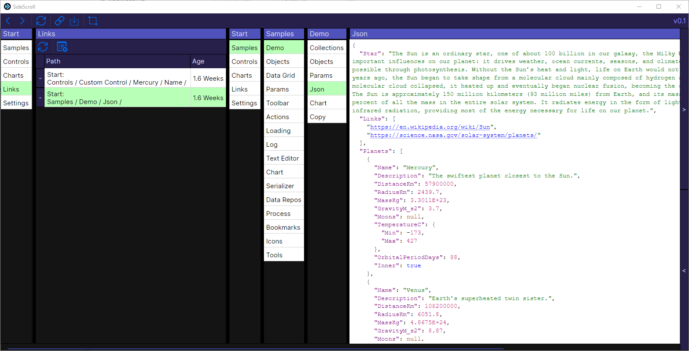

# User Guide

## Selecting Items
* Use `Ctrl` or `Shift` to select multiple items
* Previous selections are remembered, and used to select future options when loading the same or similar tabs

## Scrolling
* There's a few different ways to scroll
  - The Keyboard's Left & Right Arrow keys, usually the quickest way to scroll
  - The Left & Right buttons on the right side
  - The scrollbar on the bottom

## DataGrid Searching
* Press `Ctrl + F` on any Data Grid to show the search (You can click anywhere on a tab to focus it)
* You can use `|` or `&` to restrict searches
* Examples:
  - Search for the exact string `"ABC"` or anything containing `123`
    - `"ABC" | 123`
* Recursive searches will eventually be supported

## Hints
* To copy the cell data to the clipboard, you can right click on the cell and select `Copy`
* You can clear the local disk cache & settings by going to `Samples` -> `Data Repos` and clicking `Delete`

## Links

You can save a link for any location in the UI. Override the `Linker` class to add new methods that add and retrieve links.

## Widescreen monitor recommended

SideScroll automatically displays all entries in a recursive Parent->Child->Sub-Child...and will keep going until it hits the edge of your screen or an object that can't be expanded. Because of this, entries can easily get to be 10-20 levels deep. You always have the option of scrolling to the side with SideScroll, but it really shines with a widescreen monitor. It's much easier to use when everything is visible at once.

## Theming
- You can switch between Light & Dark mode in the Settings, as well as define your own custom theme
- Themes can be shared as json by clicking the export & import buttons