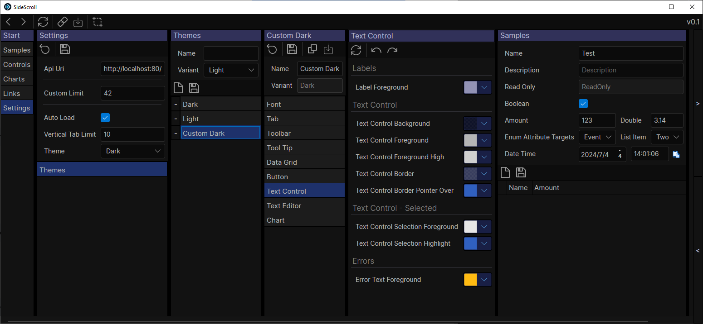

# SideScroll
SideScroll is a cross platform Avalonia UI framework designed for quickly navigating through a tree of tabs. Every tab that shows will automatically select the next most likely tabs, and the next, until you need to start scrolling. Navigate 20 or even 50 tabs deep, and create links to save or share with others.

SideScroll is designed with speed in mind, for both development and usage. Most tabs are created in code which makes them easier to link together and refactor later. Any object can be viewed or edited by adding it to a tab, with all the controls being automatically created for you, and customized via attributes. DataRepos can be used to save and load these objects, and the selected items can be passed in links automatically.

## Features
* .NET Cross Platform [Avalonia UI](https://github.com/AvaloniaUI/Avalonia) Framework that can run on any Windows, MacOS, or Linux system
* Previous selections are used to automatically select the most likely new items
* Open multiple paths at once to easily compare or update items
* Create Links to share views with others
* Use DataRepos to manage your local saving & loading
* Load any object in a Param Control to create a form with matching Avalonia controls
* Chart line series using the [LiveCharts 2](https://github.com/beto-rodriguez/LiveCharts2) controls
* RichText document support using the [AvaloniaEdit](https://github.com/AvaloniaUI/AvaloniaEdit) controls

## Examples
#### VideoGamesDB

## Screenshots
#### Light Theme

#### Dark Theme

#### Custom Theming

#### Rich Text Editing with AvaloniaEdit

#### Share Links

### Documentation
* [Development](Docs/Dev/Development.md)
* [User Guide](Docs/UserGuide.md)
* [Credits](Docs/Credits.md)

### Samples
Try one of the samples out to see SideScroll in action
* [Tab Samples](/Programs/SideScroll.Start.Avalonia/MainWindow.cs) - Inside this repo
* [Video Game Database](https://github.com/SideScrollUI/VideoGamesDB) - Sample external project

## License
* [MIT](LICENSE)