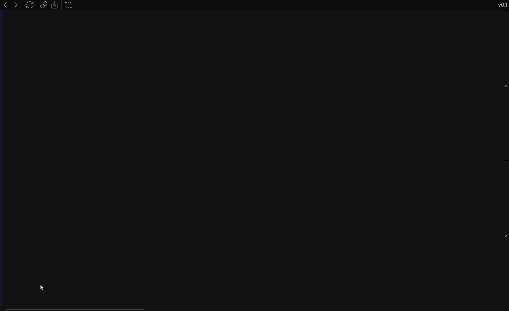
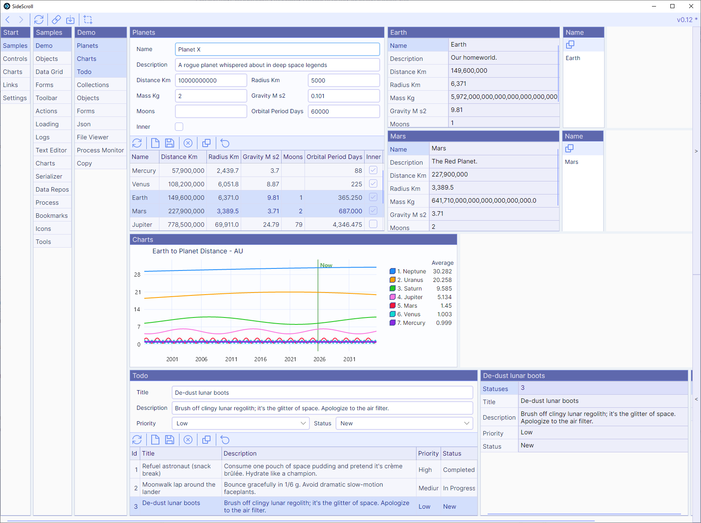
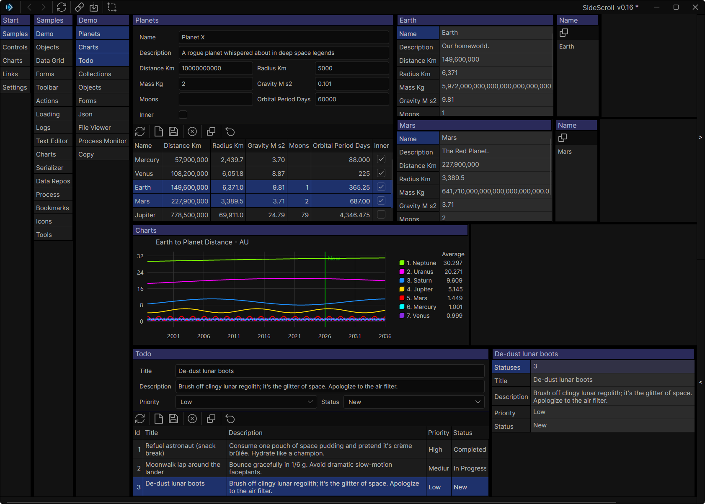
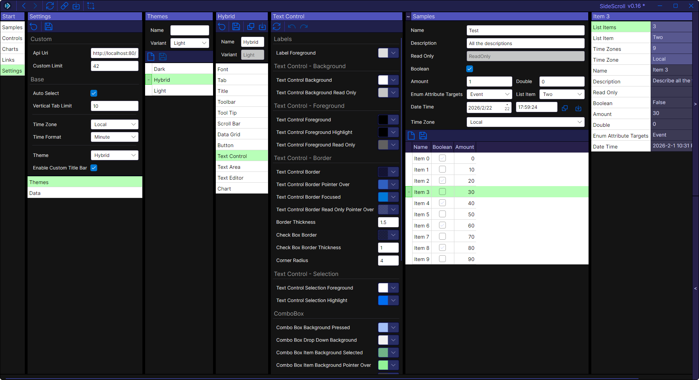
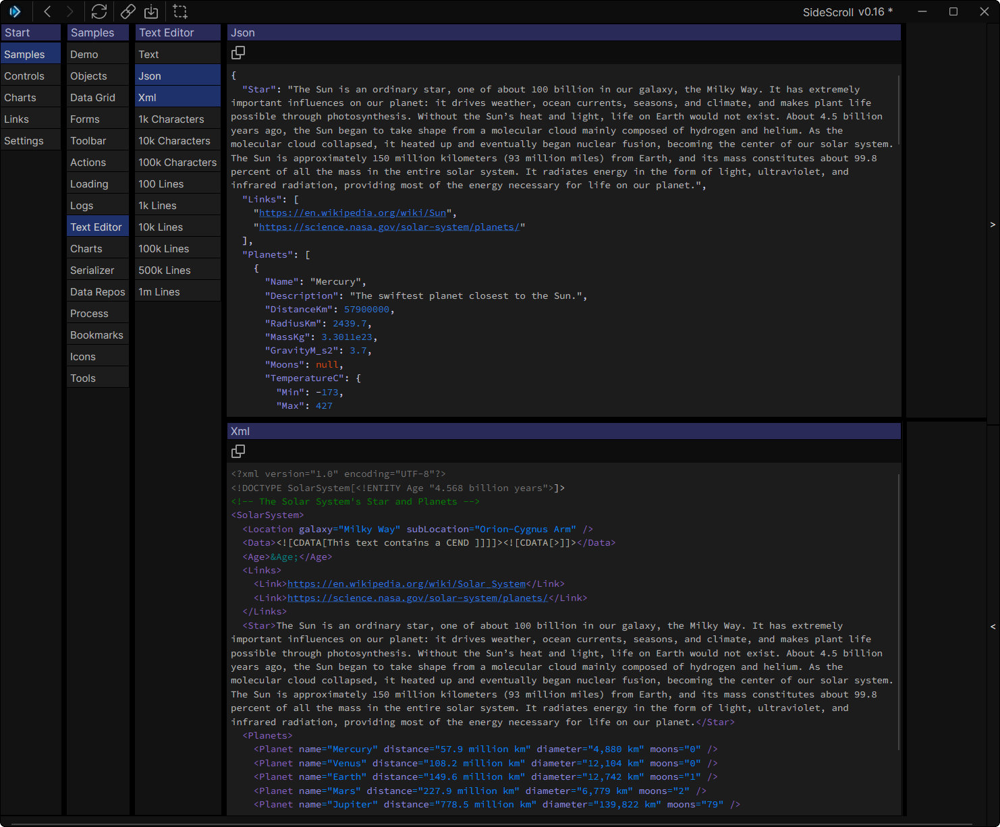
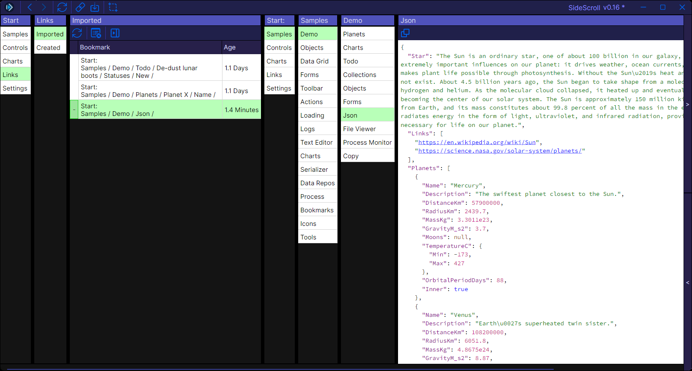

# SideScroll

[](https://sidescrollui.github.io/SideScroll/)
[](https://www.nuget.org/packages/SideScroll)
[](LICENSE)
[](https://dotnet.microsoft.com/download)
[](https://github.com/AvaloniaUI/Avalonia)

**A cross-platform Avalonia UI framework for building fast, navigable, data-driven applications with automatically generated forms and smart tab navigation.**

SideScroll is designed for navigating complex data hierarchies with speed and developer productivity in mind. It automatically selects the most likely next tabs as you navigate, allowing you to drill down 20, 30, or even 50 levels deep with ease. Every view can be saved as a shareable link, and any object can be instantly displayed or edited with auto-generated controls.

---

## ✨ Key Features

- **🚀 Smart Tab Navigation** — Automatically predicts and displays the next most relevant tabs based on your navigation patterns
- **🖥️ Cross-Platform** — Built on [Avalonia UI](https://github.com/AvaloniaUI/Avalonia), runs on **Windows, macOS, Linux**, and **Web (WASM)**
- **⚡ Rapid Development** — Create tabs in code for easy linking and refactoring; no XAML required
- **🎨 Dynamic Forms** — Load any object into a **TabForm** and get auto-generated Avalonia controls with attribute-based customization
- **💾 DataRepos** — Manage local data storage with data-bound views and automatic serialization
- **🔗 Shareable Links** — Create and share deep links to any view or data state
- **📊 Interactive Charting** — Integrated [LiveCharts 2](https://github.com/beto-rodriguez/LiveCharts2) with smooth animations, zooming, and interactive legends
- **📝 Rich Text Editing** — Built-in [AvaloniaEdit](https://github.com/AvaloniaUI/AvaloniaEdit) support for syntax highlighting and text manipulation
- **🎨 Customizable Themes** — Light, dark, and custom themes with exportable/importable JSON configurations
- **🔍 Advanced Filtering** — Powerful DataGrid filtering with nested queries and operators

---

## 🎬 Live Demo

**Try SideScroll in your browser:** [https://sidescrollui.github.io/SideScroll/](https://sidescrollui.github.io/SideScroll/)

The demo runs entirely in WebAssembly using Avalonia's browser support—no installation required!

> **Note:** The browser version is experimental. For the best performance and full features, use the desktop application.

---

## 📸 Screenshots & Examples

### VideoGamesDB Sample



### Light Theme



### Dark Theme



### Custom Theming - Hybrid Theme



### Rich Text Editing with AvaloniaEdit



### Shareable Links



---

## 🚀 Getting Started

### Prerequisites

- [.NET 8 SDK](https://dotnet.microsoft.com/download/dotnet/8.0) or later
- Git
- Your preferred IDE:
  - [Visual Studio 2026](https://visualstudio.microsoft.com/) (Windows/Mac)
  - [Visual Studio Code](https://code.visualstudio.com/) (All platforms)
  - [JetBrains Rider](https://www.jetbrains.com/rider/) (All platforms)

### Installation & Running

1. **Clone the repository**
   ```bash
   git clone https://github.com/SideScrollUI/SideScroll.git
   cd SideScroll
   ```

2. **Restore dependencies**
   ```bash
   dotnet restore
   ```

3. **Build the solution**
   ```bash
   dotnet build
   ```

4. **Run the desktop demo application**
   ```bash
   dotnet run --project Programs/SideScroll.Demo.Avalonia.Desktop/SideScroll.Demo.Avalonia.Desktop.csproj
   ```

### Quick Start - Create Your Own App

1. **Install SideScroll templates**
   ```bash
   dotnet new install SideScroll.Templates
   ```

2. **Create a new SideScroll application**
   ```bash
   dotnet new sidescroll.app -o MyApp
   ```
   
   Or create a solution with library and program projects:
   ```bash
   dotnet new sidescroll.sln -o MyApp
   ```

3. **Run your new app**
   ```bash
   cd MyApp
   dotnet run
   ```

See the [Project Setup Guide](Docs/Dev/ProjectSetup.md) and [SideScroll.Templates](https://github.com/SideScrollUI/SideScroll.Templates) for more details.

---

## 📦 Project Structure

```
SideScroll/
├── Libraries/                          # Core framework libraries
│   ├── SideScroll/                     # Core functionality (Call, Tag, logging)
│   ├── SideScroll.Avalonia/            # Avalonia UI components
│   ├── SideScroll.Avalonia.Charts/     # Chart abstractions
│   ├── SideScroll.Avalonia.Charts.LiveCharts/  # LiveCharts implementation
│   ├── SideScroll.Avalonia.Samples/    # Sample tabs and demos
│   ├── SideScroll.Network/             # HTTP and network utilities
│   ├── SideScroll.Resources/           # Embedded resources (icons, samples)
│   ├── SideScroll.Serialize/           # Serialization and DataRepos
│   ├── SideScroll.Serialize.Browser/   # Browser-specific serialization
│   ├── SideScroll.Tabs/                # Tab system core
│   ├── SideScroll.Tabs.Samples/        # Sample tab implementations
│   └── SideScroll.Tabs.Tools/          # File viewer and utility tabs
├── Programs/                           # Runnable applications
│   ├── SideScroll.Demo.Avalonia.Desktop/   # Desktop demo app
│   └── SideScroll.Demo.Avalonia.Browser/   # WebAssembly demo app
├── Tests/                              # Unit and integration tests
├── Docs/                               # Documentation
└── Images/                             # Screenshots and assets
```

---

## 📚 Documentation

### For Users
- **[User Guide](Docs/UserGuide.md)** — How to use SideScroll applications
- **[Live Demo](https://sidescrollui.github.io/SideScroll/)** — Try it in your browser

### For Developers
- **[Project Setup](Docs/Dev/ProjectSetup.md)** — Setting up your first SideScroll project
- **[Development Guide](Docs/Dev/Development.md)** — Core concepts and development workflow
- **[Adding Tabs](Docs/Dev/AddingTabs.md)** — Creating custom tabs
- **[TabForms](Docs/Dev/TabForms.md)** — Auto-generated forms for objects
- **[DataRepos](Docs/Dev/DataRepos.md)** — Data storage and management
- **[Bookmarks](Docs/Dev/Bookmarks.md)** — Creating shareable links
- **[Charts](Docs/Dev/Charts.md)** — Adding interactive charts
- **[Logs](Docs/Dev/Logs.md)** — Logging and debugging
- **[Projects](Docs/Dev/Projects.md)** — Project configuration
- **[Serializer](Docs/Dev/Serializer.md)** — Object serialization

### Additional Resources
- **[Credits](Docs/Credits.md)** — Acknowledgments and third-party libraries
- **[Changelog](CHANGELOG.md)** — Version history and release notes
- **[Contributing Guide](CONTRIBUTING.md)** — How to contribute to SideScroll

---

## 🎯 Sample Projects

Explore these examples to see SideScroll in action:

- **[Tab Samples](Libraries/SideScroll.Avalonia.Samples/MainWindow.cs)** — Included in this repository
- **[Video Game Database](https://github.com/SideScrollUI/VideoGamesDB)** — External sample project demonstrating real-world usage

---

## 🤝 Contributing

We welcome contributions! Whether it's bug reports, feature requests, documentation improvements, or code contributions, your help is appreciated.

**Before contributing:**
1. Read the [Contributing Guide](CONTRIBUTING.md)
2. Check existing [issues](https://github.com/SideScrollUI/SideScroll/issues) and [pull requests](https://github.com/SideScrollUI/SideScroll/pulls)
3. For major changes, open an issue first to discuss your proposal

**Quick Contribution Checklist:**
- [ ] Code follows the project's style guidelines
- [ ] Tests pass: `dotnet test`
- [ ] Documentation is updated (if applicable)
- [ ] Changelog is updated (for significant changes)

---

## 🔧 Technology Stack

- **UI Framework:** [Avalonia UI 11.3+](https://avaloniaui.net/)
- **Runtime:** .NET 8.0+
- **Charting:** [LiveCharts 2](https://livecharts.dev/)
- **Text Editing:** [AvaloniaEdit](https://github.com/AvaloniaUI/AvaloniaEdit)
- **Testing:** [NUnit](https://nunit.org/)
- **Serialization:** System.Text.Json

---

## 📄 License

This project is licensed under the **MIT License** - see the [LICENSE](LICENSE) file for details.

---

## 🌟 Why SideScroll?

**Perfect for:**
- 🗂️ Data exploration tools with complex hierarchies
- 🔍 Debugging interfaces with deep object inspection
- 📊 Dashboard applications with related data views
- 🛠️ Developer tools requiring quick navigation between components
- 📖 Knowledge bases with interconnected information

**Recommended Setup:**
- Widescreen monitor for optimal experience (SideScroll shines when you can see multiple levels at once!)
- Mouse with horizontal scroll or keyboard navigation for quick scrolling

---

<div align="center">


**[Try the Live Demo](https://sidescrollui.github.io/SideScroll/)** • **[View Documentation](Docs/UserGuide.md)** • **[Report an Issue](https://github.com/SideScrollUI/SideScroll/issues)**

</div>
