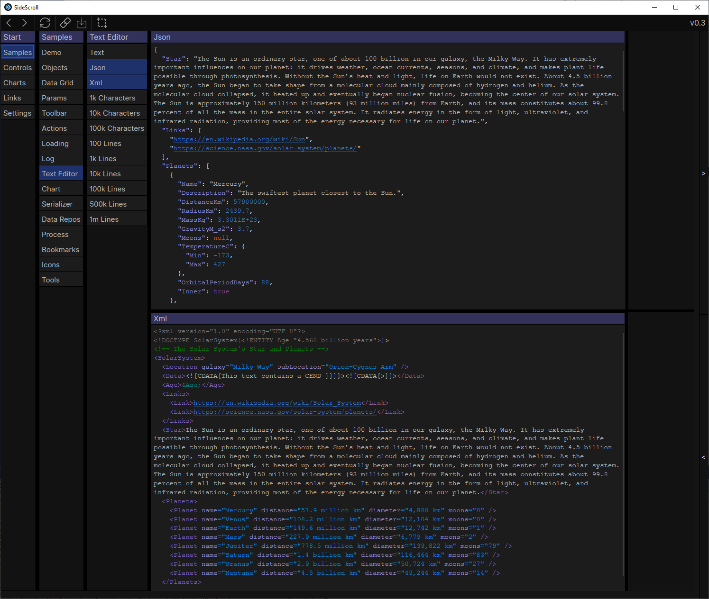

# SideScroll

SideScroll is a cross platform Avalonia UI framework designed for quickly navigating through a tree of tabs. Every tab that shows will automatically select the next most likely tabs, and the next, until you need to start scrolling. Navigate 20 or even 50 tabs deep, and create links to save or share with others.

SideScroll is designed with speed in mind, for both development and usage. Most tabs are created in code which makes them easier to link together and refactor later. Any object can be viewed or edited by adding it to a tab, with all the controls being automatically created for you, and customized via attributes. DataRepos can be used to save and load these objects, and the selected items can be passed in links automatically.

## Features

- **Cross-Platform .NET [Avalonia UI](https://github.com/AvaloniaUI/Avalonia) Framework** — Supports **Windows, macOS, and Linux** 
- **Smart Tab Navigation** — Automatically selects the next most likely items based on past usage.
- **Multiple Path Support** — Open and compare multiple paths simultaneously.
- **Shareable Links** — Create links to share views with others.
- **DataRepos** — Manage local data storage and display data bound views
- **Dynamic Form Generation** — Load any object into a **TabForm** for auto-generated Avalonia controls.
- **Rich Text Support** — Integrated [AvaloniaEdit](https://github.com/AvaloniaUI/AvaloniaEdit) support for rich text viewing and editing
- **Interactive Charting** — Integrated [LiveCharts 2](https://github.com/beto-rodriguez/LiveCharts2) support for smooth, animated charts. Use the mouse to zoom in or select a series to show additional tabs.

## Examples

#### VideoGamesDB

## Screenshots

#### Light Theme

#### Dark Theme

#### Custom Theming - Light Blue Theme

#### Rich Text Editing with AvaloniaEdit

#### Share Links

## Documentation

* [Development](Docs/Dev/Development.md)
* [User Guide](Docs/UserGuide.md)
* [Credits](Docs/Credits.md)

## Samples

Try one of the samples out to see SideScroll in action
* [Tab Samples](/Programs/SideScroll.Start.Avalonia/MainWindow.cs) - Inside this repo
* [Video Game Database](https://github.com/SideScrollUI/VideoGamesDB) - Sample external project

## License

* [MIT](LICENSE)